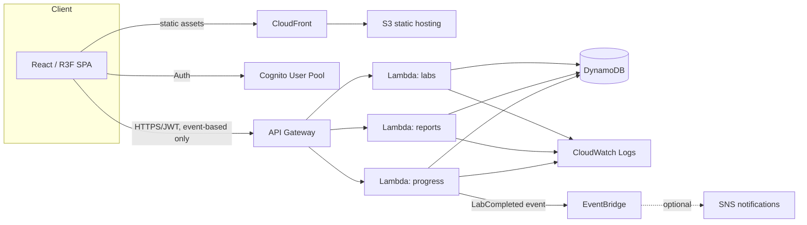

# CONTROLREADY — Architecture

"Train Like You Already Have the Job."

This document describes the MVP architecture and the engineering decisions behind it, written so a new lab (BMS, conveyor) or a future AI Tutor can be added without reworking the core engine.

> **Note on the MVP:** the MVP contains **no AI, no Amazon Bedrock, no paid API calls of any kind.** All troubleshooting guidance is a deterministic, rule-based hint engine. The architecture is deliberately shaped so an AI Tutor can be dropped in later as an **optional premium feature** behind the same interface the rule-based engine already implements — see §6.

## 1. Product shape

CONTROLREADY is a browser-based training simulator. A student is handed a **work order**, walks into a **3D lab**, and has to diagnose and fix a realistic industrial fault using the same tools a real technician uses: a network diagnostic console, a PLC tag/ladder monitor, a VFD parameter panel, and a rule-based hint system that nudges instead of answering.

The MVP ships exactly one lab (**Lab 1 — Motor Control Room**) end to end, plus the scaffolding (routing, data model, scoring engine, hint engine, instructor mode, dashboard, portfolio) needed to add Lab 2 (Conveyor) and Lab 3 (BMS Mechanical Room) later with minimal churn.

## 2. Design decisions (and why)

| Decision | Reasoning |
|---|---|
| **3D built from primitives (boxes/cylinders/panels), not imported CAD models** | Keeps the bundle small and the browser experience lightweight, per spec. Realism comes from labeling, layout, and animation, not polygon count. |
| **All simulation logic (network, PLC, VFD, scoring, hints) runs client-side in TypeScript** | Spec requires AWS usage to stay low and the app to work with zero AWS credentials. A local deterministic engine also makes it fully offline-capable. |
| **No AI/Bedrock in MVP; `HintProvider` interface instead** | `hintEngine.ts` implements a scripted, state-aware hint ladder (identical shape to what an AI Tutor would return later: `{ text, level, isFinalAnswer }`). A future `aiHintProvider.ts` can implement the same `HintProvider` interface and be swapped in behind a feature flag — no caller changes. This is the seam for the "optional premium AI Tutor" requirement. |
| **Zustand for state, not Redux** | Single small store, minimal boilerplate, trivial to serialize into a `TroubleshootingSession` record for the backend. |
| **Labs are data, not code** | A lab is a `LabDefinition` object (devices, network topology, ladder program, fault catalog, work order, grading weights). `LabRunner.tsx` is a generic page that reads this definition. Adding Lab 2 means writing a new `LabDefinition`, not a new page architecture. |
| **Faults are declarative and instructor-selectable** | A `FaultScenario` has `apply(state)` and `isResolved(state)`. Instructor Mode is just "pick a `FaultScenario` id before the student starts" — the same catalog used for auto-assignment. |
| **No real hardware in MVP** | Explicitly out of scope. `networkEngine`/`plcEngine` are pure functions — the seam where a future secure gateway to real PLCs/BMS controllers would plug in (see ROADMAP.md). |
| **No EC2, no RDS, no Bedrock in the AWS design** | Per spec: serverless only, lowest reasonable cost, and simulator state is not continuously streamed to AWS — only meaningful events (session start/complete, score, report) are persisted. |

## 3. Frontend architecture

The UI follows a **library → immersive lab** structure: a Lab Library for choosing a job scenario, and a full-screen 3D `LabRunner` where the 3D plant is the dominant surface (mission stepper + a slim toolbar are the only permanent chrome; every tool is a window opened on demand).

```
frontend/src/
  pages/                 Landing, LabLibrary, Progress, Skills, Portfolio, InstructorSetup, LabRunner
  labs/
    labCatalog.ts        metadata for the Lab Library grid (10 labs; only Lab 1 has a routeId)
    lab1-motor-control/
      definition.ts      devices, tags, ladder program, fault catalog, work order, grading weights
      Scene.tsx          the 3D room, equipment, and conveyor for this lab
      cameraPresets.ts    named camera fly-to targets (Overview/Control Cabinet/Conveyor/Motor/Engineering PC)
  engine/
    networkEngine.ts     ping / IP / subnet / gateway / discovery simulation, pure functions
    plcEngine.ts         ladder-logic scan engine (rung evaluation, tag table)
    vfdEngine.ts         VFD parameter + fault simulation
    scoringEngine.ts     converts the action log into a Troubleshooting Score
    hintEngine.ts        rule-based, state-aware progressive hint ladder (the "HintProvider")
    reportRubric.ts      rule-based service report validation/scoring (no AI grading)
  state/
    simStore.ts          zustand store: device state, tags, network, fault, action log, hints,
                          UI state (inspected device, active tool window, camera requests, mission phase)
    progressStore.ts     zustand store persisted to localStorage: progress/skills/portfolio data
  components/
    lab3d/                Room, Conveyor, CameraRig, primitives (StatusLight, DeviceLabel, EthernetLink,
                          useHoverHighlight), SimulationClock
    hud/                  TopBar, MissionStepper, WorkOrderCard/Modal, CameraPresetButtons,
                          EngineeringWorkstationModal, BottomToolbar, ToolWindow, ScoreModal
    panels/               DeviceInspector (+ VfdInspector, GenericDeviceInspector), NetworkToolsPanel,
                          PlcSoftwareWindow, ScadaPanel, ReportCard, HintPanel
    shared/               DeviceNetworkFields (IP/subnet/gateway editor, reused by 3 different panels)
    labs/                 LabThumbnail (lab-library card art)
    dashboard/            SkillMeter, BadgeGrid
    portfolio/            AccomplishmentList
  types/                  shared TS types (Device, Tag, Rung, Fault, WorkOrder, Score, HintProvider...)
```

**UI model inside a lab:**
- Clicking any piece of 3D equipment sets `simStore.inspected`, opening a small contextual slide-over (`DeviceInspector`) with that device's status and quick actions — it never leaves the 3D scene.
- The **bottom toolbar** and the **Engineering PC** (via a workstation launcher modal) both set `simStore.activeTool`, opening one of the four full-size tool windows (Network Tools / PLC Software / SCADA / Report) as an overlay above the 3D scene. Only one is open at a time, keeping the 3D room dominant otherwise.
- `MissionStepper` renders a derived `getMissionPhase()` selector (Inspect → Diagnose → Repair → Test → Report) computed from the action log and live state — there's no separate "phase" field to keep in sync, and the student is never forced into the exact order.
- Camera moves (`flyTo`) are a store-driven request (`cameraPreset` + a monotonic `cameraRequestId`) consumed by `CameraRig` inside the Canvas via `useFrame` lerp — this lets HUD buttons outside the Canvas trigger camera animation without prop-drilling a Three.js ref through React context.

State flow: user interacts with a 3D object or a panel → dispatches an action to `simStore` → `simStore` re-runs `plcEngine`/`networkEngine`/`vfdEngine` every render frame via `SimulationClock` → derived state (motor running, status lights, comm health, conveyor motion) re-renders the 3D scene and open panels → every meaningful action is appended to the action log used by `scoringEngine`, `hintEngine`, and `getMissionPhase`.

**3D rendering note:** the room, cabinet, conveyor, and equipment are built from Three.js primitives (boxes/cylinders/planes) with careful lighting and layout rather than authored GLTF/PBR assets — there's no asset pipeline in this MVP. This keeps the bundle small and avoids a licensing/sourcing question for 3D models, at the cost of Factory-I/O-level photorealism; realism instead comes from the enclosed room shell, cable trays, zone layout, and live equipment feedback (status lights, motor rotation, conveyor motion). See ROADMAP.md for the GLTF upgrade path.

**React StrictMode is intentionally disabled** (`main.tsx`) — its dev-mode double-mount briefly creates two WebGL contexts for the same `<canvas>`, and some browsers/sandboxes resolve that by losing the first context (observed directly during development). This is a known R3F/StrictMode interaction, not a workaround for an application bug.

## 4. Backend architecture (AWS, serverless, no EC2/RDS/Bedrock)



Only progress/report/lab-catalog endpoints exist — there is no AI endpoint in the MVP. Simulator logic (network/PLC/VFD/scoring/hints) never leaves the browser:

- `POST /progress` / `GET /progress/{userId}` — write/read `StudentProgress`, `Scores`, `TroubleshootingSessions` in DynamoDB. Only called on session start and session complete, not per-tick.
- `POST /reports` — persist a submitted `ServiceReport` plus its locally computed rubric score.
- `GET /labs` — serves the lab catalog (`LabDefinition` summaries) so the frontend doesn't have to hardcode which labs exist — trivial today (Lab 1 only) but this is the extension point for Lab 2/3.

Demo Mode never calls any of these — it reads/writes `localStorage` instead, so `npm install && npm run dev` works with zero AWS credentials.

## 5. Data model (DynamoDB)

See [`backend/models/schema.md`](backend/models/schema.md). Tables: `Users`, `Labs`, `WorkOrders`, `StudentProgress`, `TroubleshootingSessions`, `FaultScenarios`, `Scores`, `ServiceReports`.

## 6. The AI Tutor seam (not built in MVP)

`types/hints.ts` defines:

```ts
interface HintProvider {
  getHint(context: SimState, hintsAlreadyGiven: number): Hint;
}
interface Hint {
  level: number;
  text: string;
  isFinalAnswer: boolean;
}
```

`hintEngine.ts` implements `HintProvider` today with a fixed, state-aware ladder (see §8). A future premium tier would add `aiHintProvider.ts` implementing the same interface by calling Bedrock through a new `/ai/hint` Lambda, gated by a `hintProvider: "rules" | "ai"` setting on the student's plan. **No component code changes** — `HintPanel.tsx` only ever calls `hintProvider.getHint(...)`. This is the entire point of isolating the interface now.

## 7. Demo Mode vs AWS Mode

Single env flag: `VITE_DEMO_MODE` (default `true`).

| Capability | Demo Mode | AWS Mode |
|---|---|---|
| 3D lab, network/PLC/VFD simulation, scoring, hints | Local, always | Local, always (unchanged — never server-side) |
| Report validation | `reportRubric.ts`, local | Same, plus persisted via `/reports` |
| Dashboard/Portfolio persistence | `localStorage` | DynamoDB via `/progress`, Cognito-authenticated |
| Auth | "Continue as Demo Student" (no login) | Cognito Hosted UI |

`git clone` → `npm install` → `npm run dev` is a fully working product with zero AWS credentials and zero paid APIs, which is the explicit MVP requirement.

## 8. Hint ladder (Lab 1, rule-based)

1. "Check communication with the devices involved in the motor circuit."
2. "Verify communication between the PLC and VFD."
3. "Try pinging the VFD."
4. "Compare the VFD network configuration with the PLC network."
5. "Check whether the VFD IP address is on the same subnet as the PLC." (final answer available on request after this point)

Each `FaultScenario` in the catalog carries its own hint ladder in this shape so future scenarios (duplicate IP, disconnected cable, overload tripped, etc.) plug in without touching `hintEngine.ts`.

## 9. Instructor Mode

A lightweight pre-session screen: instructor picks a `FaultScenario` id from the lab's catalog (or "Random") before the student's session starts. Only `wrong_vfd_ip` is fully simulated in MVP; the rest of the catalog is defined with `implemented: false` and surfaces as "Coming Soon" in the picker rather than a dead button.

## 10. What's deliberately deferred

See [`ROADMAP.md`](ROADMAP.md): Lab 2 (Conveyor), Lab 3 (BMS), remaining fault scenarios (duplicate IP, disconnected cable, overload tripped, stop-circuit-open, sensor failure), optional premium AI Tutor, EtherNet/IP-accurate framing, BACnet/Modbus/OPC UA/MQTT protocol simulation, real-hardware gateway, CDK IaC, exportable PDF portfolio.
