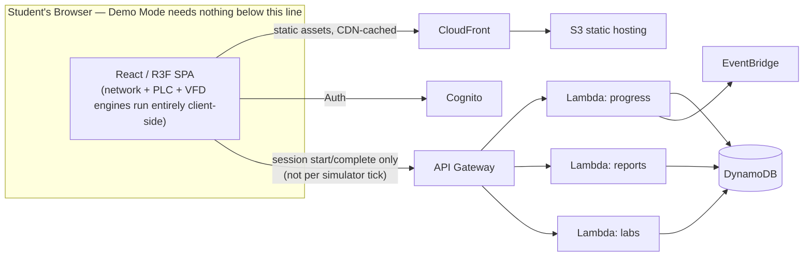

# CONTROLREADY

**"Train Like You Already Have the Job."**

> Don't watch someone do automation. Come to work and do automation.

CONTROLREADY is an interactive 3D training simulator for entry-level Automation/Controls/PLC/BMS Technicians. Instead of watching videos or answering quiz questions, a student receives a realistic **work order**, walks into a live **3D control room**, and has to diagnose and repair a real industrial fault using the same tools a technician actually uses on day one: an industrial network diagnostic console, a PLC tag/ladder-logic monitor, and a VFD configuration panel — then document the repair in a service report and receive a graded Troubleshooting Score.

This repo contains the MVP: one complete, polished lab (**Lab 1 — Motor Control Room**) built so additional labs (Conveyor, BMS Mechanical Room) can be added later without reworking the core engine. See [`ARCHITECTURE.md`](ARCHITECTURE.md) for the full design rationale and [`ROADMAP.md`](ROADMAP.md) for what's deliberately deferred.

**No AI. No Amazon Bedrock. No paid APIs.** All troubleshooting guidance is a deterministic, rule-based hint engine — see ARCHITECTURE.md §6 for how an optional premium AI Tutor could be added later behind the same interface.

## Table of Contents
- [Screenshots](#screenshots)
- [Technologies Used](#technologies-used)
- [Architecture](#architecture)
- [Project Structure](#project-structure)
- [Local Development (Demo Mode)](#local-development-demo-mode)
- [Running Tests](#running-tests)
- [AWS Deployment](#aws-deployment)
- [Demo Credentials](#demo-credentials)
- [Roadmap](#roadmap)

## Screenshots

> Run the app locally (`npm run dev` — see below) and drop your own screenshots here. Suggested shots: the Dashboard, the 3D lab with the Work Order panel open, the Network Console mid-diagnosis, the PLC ladder logic monitor with an active rung, and the Work Order Complete score screen.

```
docs/screenshots/
  dashboard.png
  lab-work-order.png
  network-console.png
  plc-monitor.png
  score-screen.png
```

## Technologies Used

**Frontend:** React, TypeScript, Vite, Three.js, React Three Fiber, Drei, Zustand, React Router, Tailwind CSS, Vitest

**Backend (AWS deployment, optional):** Python 3.12 Lambda functions, boto3

**AWS (serverless only — no EC2, no RDS, no Bedrock):** S3, CloudFront, Cognito, API Gateway (HTTP API), Lambda, DynamoDB, CloudWatch, EventBridge, (optional) SNS

## Architecture

See [`ARCHITECTURE.md`](ARCHITECTURE.md) for the full write-up. Summary:



Why the simulator runs entirely in the browser: normal PLC/VFD/network logic is deterministic and cheap — there's no reason to pay for a round trip to AWS for every ping or ladder scan. AWS is only involved to persist meaningful events (a completed lab, a submitted report) and to authenticate students in production.

## Project Structure

```
controlready-ai/
  frontend/            React + Vite + R3F app — the whole product runs from here in Demo Mode
    src/
      engine/           pure TS: networkEngine, plcEngine, vfdEngine, scoringEngine, hintEngine, reportRubric
      state/            zustand stores: simStore (live lab state), progressStore (localStorage-persisted)
      labs/
        lab1-motor-control/   definition.ts (data) + Scene.tsx (3D)
      components/
        lab3d/          3D primitives (status lights, cable links, labels)
        panels/         WorkOrder, NetworkConsole, PLCMonitor, VFD, HintPanel, ServiceReport, ScoreScreen, Hud
        dashboard/       portfolio/    layout/
      pages/            Landing, Dashboard, InstructorSetup, LabRunner, Portfolio
  backend/              Python Lambda handlers (progress, reports, labs) — used only in AWS Mode
    lambdas/
    common/
    models/schema.md    DynamoDB table designs
  infrastructure/
    template.yaml       AWS SAM template (S3 + CloudFront + Cognito + API Gateway + Lambda + DynamoDB)
  docs/
  ARCHITECTURE.md
  ROADMAP.md
```

## Local Development (Demo Mode)

Demo Mode is the default and requires **zero AWS credentials and zero API keys**.

```bash
cd frontend
npm install
npm run dev
```

Open the printed local URL, click **Continue as Demo Student**, then **Start Work Order — Lab 1**. Progress is saved to `localStorage` so it survives a page reload.

Production build:

```bash
cd frontend
npm run build   # tsc -b && vite build
npm run preview # serve the production build locally
```

### Try Work Order #1001 yourself

1. Open the **Network** panel, ping `192.168.1.20` from the Engineering PC — it will time out.
2. Check the VFD's device card: it's actually configured at `192.168.2.20`, a different subnet than the PLC (`192.168.1.10/255.255.255.0`).
3. Correct the VFD's IP to `192.168.1.20` / `255.255.255.0` and click **Apply**.
4. Open the **PLC** panel and press **Start** — watch Rung 1 and Rung 2 go TRUE and `Motor_Running` flip to TRUE.
5. Click to verify `Motor_Running = TRUE`, then fill out and submit the **Report**.
6. Read your Troubleshooting Score and earned skill on the Work Order Complete screen.

Stuck? Click **Hint** in the top bar for a progressive, rule-based hint ladder — it won't just hand you the answer.

## Running Tests

```bash
cd frontend
npm test
```

Covers: IPv4/subnet validation, `ping` outcomes (success, timeout, wrong subnet, duplicate IP, cable/power faults), the ladder-logic seal-in/interlock/timer engine, VFD ramp + comm-loss behavior, fault-resolution detection, and the scoring rubric.

## AWS Deployment

The frontend is fully usable without AWS. Deploying the backend adds Cognito auth and durable progress/report storage.

**Prerequisites:** AWS CLI configured, [AWS SAM CLI](https://docs.aws.amazon.com/serverless-application-model/latest/developerguide/install-sam-cli.html), Python 3.12.

```bash
# 1. Deploy the backend stack (API Gateway, Lambda, DynamoDB, Cognito)
cd infrastructure
sam build
sam deploy --guided
# Note the ApiUrl, UserPoolId, UserPoolClientId, FrontendBucketName, CloudFrontDomain outputs

# 2. Point the frontend at the deployed API
cd ../frontend
cp .env.example .env   # then edit: VITE_DEMO_MODE=false, fill in the outputs above
npm run build

# 3. Publish the frontend to S3 + invalidate CloudFront
aws s3 sync dist/ s3://<FrontendBucketName> --delete
aws cloudfront create-invalidation --distribution-id <distribution-id> --paths "/*"
```

Seed the `Labs` DynamoDB table with at least the Lab 1 catalog row so `GET /labs` returns something:

```bash
aws dynamodb put-item --table-name ControlReady-Labs --item '{
  "labId": {"S": "lab1-motor-control"},
  "name": {"S": "Motor Control Room"},
  "status": {"S": "available"}
}'
```

See [`.env.example`](.env.example) for every environment variable used by both the frontend and the Lambda functions.

**Cost posture:** everything is on-demand serverless (no EC2, no RDS, no Bedrock). DynamoDB tables use `PAY_PER_REQUEST` billing. The frontend is static and CDN-cached. The only recurring cost at low usage is Cognito (free under 50k MAUs) and negligible Lambda/DynamoDB/CloudFront usage.

## Demo Credentials

None needed. Demo Mode uses a local "Demo Student" profile with no login — click **Continue as Demo Student** on the landing page. (AWS Mode uses standard Cognito self-service sign-up; there is no seeded demo account in the deployed stack.)

## Roadmap

See [`ROADMAP.md`](ROADMAP.md) for Lab 2 (Conveyor), Lab 3 (BMS Mechanical Room), the remaining Lab 1 fault scenarios, the optional premium AI Tutor design, and protocol depth (BACnet/Modbus/OPC UA/MQTT) plans.
